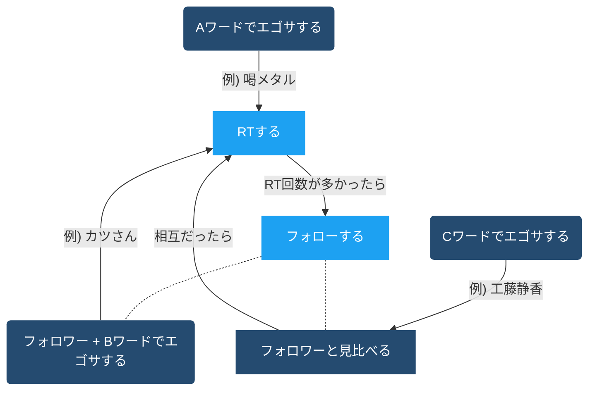

# KATSUMETAL EGOSEARCHER

```mermaid
graph TD

scrpA("Aワードでエゴサする"):::scrp
scrB("フォロワー + Bワードでエゴサする"):::scrp
scrC("Cワードでエゴサする"):::scrp
RT["RTする"]:::twitter
Follow["フォローする"]:::twitter
check["フォロワーと見比べる"]:::scrp

scrpA -->|"例) 喝メタル"| RT
scrB -->|"例) カツさん"| RT
scrC -->|"例) 工藤静香"| check
RT -->|RT回数が多かったら| Follow
Follow -.- scrB
Follow -.- check
check -->|相互だったら| RT

classDef scrp fill:#254b70,color:white,stroke-width:0px;
classDef twitter fill:#1DA1F2,color:white,stroke-width:0px;
```

liscense: I don't know well
